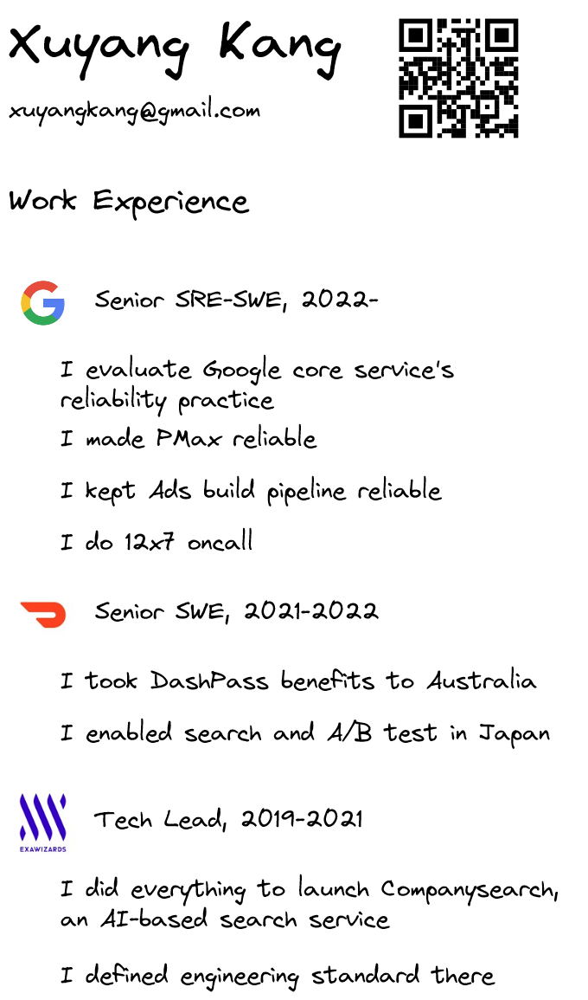
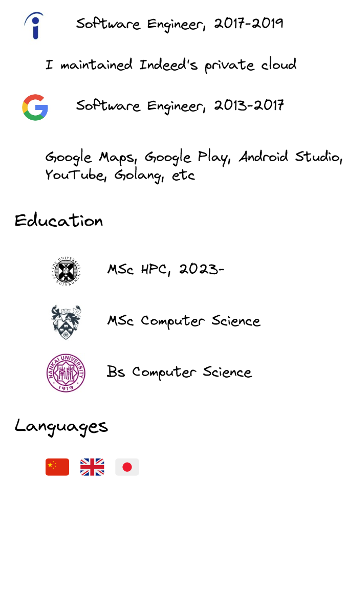

 
## Open office hours

  <!-- Google Calendar Appointment Scheduling begin -->
  <link href="https://calendar.google.com/calendar/scheduling-button-script.css" rel="stylesheet">
  
  
  <!-- end Google Calendar Appointment Scheduling -->

